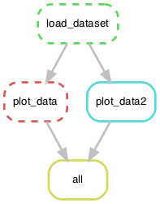

# snakemake minimal workflow


## Execute
```shell
snakemake
```

## Dryrun
```shell
snakemake -n

```

## Execute after code changes
```shell
snakemake -R `snakemake --list-code-changes`
```

## Force re-execution
```shell
snakemake -F
```

## Execute and build conda environment

The conda environment will be reconstructed from `yml` file and stored in `./.snakemake/conda`.
A single conda environment can be defined for each rule.

```shell
snakemake --use-conda
```


## Visualize workflow
```shell
snakemake --dag | dot -Tpng > ./wflow/wflow.png
```




## Benchmarking
Execution times of each rule are stored in `./benchmark`. Can be defined in `Snakefile`

## Logging
unfortunately logging is not supported for scripts thus needs to be setup
for each script individually using script-language-specific tools.
https://bitbucket.org/snakemake/snakemake/issues/917/enable-stdout-and-stderr-redirection
